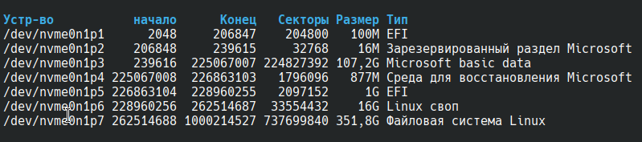
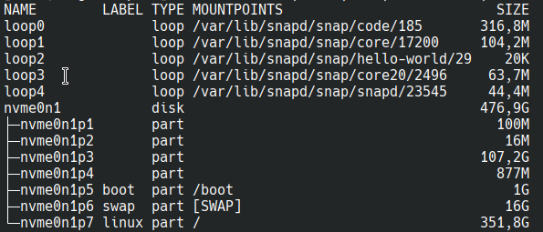

# Ультимативный гайд настройки arch linux

# 1. Загрузка
Крайнюю версию дистрибутива можно скачать с офицального [__сайта__](https://archlinux.org/download/)  
или офицального русского [__зеркала__](https://mirror.yandex.ru/archlinux/iso/latest/).


# 2. Перед установкой

## 2.1 Установка раскладки клавиатуры
Выбрать русскую раскладку 
```console
loadkeys ru
```

Выбрать консольный шрифт, поддерживающий кириллицу
```console
setfont cyr-sun16
```

## 2.2 Соединение с интернетом по Wi-fi
Проверяем название сетевого интерфейса (обычно это __wlan0__).
```console
ip link
```
Иногда сетевой интерфейс может быть отключён физически или программно.
На всякий случай разблокируем возможность переключения питания беспроводной карты
```console
rfkill unblock wifi
```

Проверим заблокированные устройства
```console
rfkill list
```

Включаем сетевой интерфейс
```console
ip link set wlan0 up
```

Проверям, что сетевая карта подключена. У меня вывел интерфейс __lo__, но подключение через __wlan0__ также работает
```console
iwctl device list
```

Выводим список доступных Wi-Fi сетей
```console
iwctl station wlan0 get-networks
```

Подключаемся к нужной сети __\<MY_WI_FI\>__. Далее попросит ввести пароль.
```console
iwctl station wlan0 connect <MY_WI_FI>
```

Проверям подключение к интернету
```console
ping ya.ru
```

## 2.3 Синхронизация системных часов
```console
timedatectl set-ntp true
```

## 2.4 Разбиение дисков на разделы
Посмотреть какие диски вам доступны можно так
```console
fdisk -l
```

Но по моему мнению самый удобный способ посмотреть диски так. Но данная комманда не выводит перед названиями дисков путь __/dev/__.
```console
lsblk -o NAME,LABEL,TYPE,MOUNTPOINTS,SIZE
```


Размечаем диск (в моейм случае это __nvme0n1__). Необходимо сделать один раздел загрузки __efi__, один под __swap__ и один под корневой раздел.
```console
cfdisk /dev/nvme0n1
```

Теперь каждый диск нужно разметить в свою файловую систему
```console
mkfs.fat -F32 /dev/nvme0n1p5 -n boot
mkswap /dev/nvme0n1p6 -L swap
mkfs.ext4 /dev/nvme0n1p7 -L linux
```

Теперь нужно смонтировать все диски. Можно указывать полное название диска или указывать метки.  
Монтируем корневой раздел
```console
mount /dev/nvme0n1p7 /mnt
```
```console
mount -L linux /mnt
```

Монтируем раздел загрузки. Также комманда создаст папку __/mnt/boot__
```console
mount --mkdir /dev/nvme0n1p5 /mnt/boot
```
```console
mount -L boot --mkdir /mnt/boot
```

Включаем подкачку
```console
swapon /dev/nvme0n1p6
```
```console
swapon -L swap
```

# 3. Установка
## 3.1 Выбор зеркал
Для ускорения загрузки пакетов необходимо поправить конфигурационный файл
```console
nano /etc/pacman.d/mirrorlist
```

В начало файла нужно добавить зеркало яндекса
```console
Server = https://mirror.yandex.ru/archlinux/$repo/os/$arch
```

## 3.2 Установка основных пакетов
__pacstrap__ используется для установки базовой системы Arch Linux в новый корневой каталог (__/mnt__ или любой другой). Он позволяет создать новую систему с нуля, устанавливая необходимые пакеты, такие как __base__, ядро (__linux__) и прошивки (__linux-firmware__). __pacstrap__ работает с помощью __pacstrap__, который является менеджером пакетов Arch Linux, но он предназначен для установки пакетов в новый корневой каталог, а не в текущую систему.
```console
pacstrap /mnt base base-devel texinfo linux linux-firmware
sudo htop git nano vim
man-db man-pages
grub os-prober efibootmgr
mtools dosfstools fuse3
networkmanager inetutils openssh
dhcpcd netctl dialog wpa_supplicant
zip unzip unrar
amd-ucode (or intel-ucode)
```

## 3.3 Создание файла fstab
Необходимо сгенерировать файл __fstab__, чтобы при последующих входов в систему диски автоматически монтировались в нужные паки
```console
genfstab -pU /mnt >> /mnt/etc/fstab
```

## 3.4 Изменить корневой каталог root
Используем __arch-chroot__ для перехода в среду chroot, которая позволяет изменить корневой каталог для запущенного процесса и его дочерних процессов
```console
arch-chroot /mnt
```

## 3.5 Установка пароля root
```console
passwd
```

## 3.6 HOSTNAME
Прописываем имя компьютера для локальной сети
```console
nano /etc/hostname
```

## 3.7 Настройка часового пояса для Московского времени
```console
ln -sf /usr/share/zoneinfo/Europe/Moscow /etc/localtime
```

## 3.8 Настройка локализации
Изменяем конфигурационный файл локализации
```console
# nano /etc/locale.gen

Нужно раскомментирвоать следующие строки

en_US.UTF-8 UTF-8
ru_RU.UTF-8 UTF-8
```

Применяем настройки локализации
```console
locale-gen
```

Указать язык системы
```console
# nano /etc/locale.conf

LANG=ru_RU.UTF-8
```

Указываем язык и шрифт для консоли
```console
# nano /etc/vconsole.conf

KEYMAP=ru
FONT=cyr-sun16
```

## 3.9 Установка загрузчика

Устанавливаем загрузочный RAM диск для установленного ядра
```console
mkinitcpio -p linux
```

Если вы ставите Arch Linux как вторую систему рядом с Windows, то нужно подключить __efi__ раздел Windows, чтобы при установке os-prober мог увидеть загрузочный раздел Windows (в моём случае это первый раздел на диске __nvme0n1p1__). При монтировании покажет предупреждение что __fstab__ файл не обновится.  Закрываем на это глаза, нам не нужно чтобы каждый раз при запуске системы монтировался __efi__ раздел Windows. На загрузку Windows это также никак не повлияет.
```console
mkdir /efi
mount /dev/nvme0n1p1 /efi
```

Далее необходимо в настройках grub разрешить работу __os-prober__
```console
# nano /etc/default/grub

В конец файла нужно прописать или раскоментировать

GRUB_DISABLE_OS_PROBER=false
```

Устанавливаем загрузчик grub по пути __/boot__, в который смонтирован раздео загрузки.
```console
grub-install --target=x86_64-efi --efi-directory=/boot --bootloader-id=GRUB
```

Генерируем загрузочный конфиг grub
```console
grub-mkconfig -o /boot/grub/grub.cfg
```

## 3.10 Перезагрузка в установленную систему
Выход из окружения chroot
```console
exit
```

Размонтировать все разделы
```console
umount -R /mnt
```

Перезагрузить систему
```console
reboot
```

# 4. Постустановка
## 4.1 Установка интернет соединения
Включаем NetworManager для подключения wi-fi. __wifi-menu__ и __dshcpcd__ могут работать не стаблильно.
```console
systemctl enable --now NetworkManager
```
Проверям запущен ли менеджер сетей
```console
systemctl status NetworkManager
```
Также демон менеджера сетей можно запустить коммандой
```console
systemctl start NetworkManager
```

Включаем wi-fi
```console
nmcli radio wifi on
```

Просмотр доступных wi-fi сетей
```console
nmcli device wifi list
```

Подключение к wifi сети
```console
nmcli device wifi connect "Название_сети" password "Пароль"
```

Проверка подключения. Комманда __ping__ находится в пакете __inetutils__.
```console
ping ya.ru
```

## 4.2 Настройка нового пользователя

Создаем нового пользователя. Вместо __\<MYUSERNAME\>__ вписать имя пользователя.
```console
useradd -m -g users -G wheel -s /bin/bash <MYUSERNAME>
```
```console
useradd -m -g users -G wheel -s /bin/bash kek
```
Установить пароль для нового пользователя. Вместо  __\<MYUSERNAME\>__ вписать имя пользователя.
```console
passwd <MYUSERNAME>
```
```console
passwd kek
```
Настроить sudo для нового пользователя.
```console
# nano /etc/sudoers

Раскомментировать нижеуказанную строку.

%wheel ALL=(ALL:ALL) ALL
```

## 4.3 Установка GUI plasma
Минимальная установка plasma
```console
pacman -S plasma-meta sddm konsole dolphin firefox ark
```

Включаем в автозапуск дисплейный менеджер
```console
sudo systemctl enable sddm
```

Самый простой путь, чтобы применить настройки и увидеть GUI нужно просто перезагрузить систему
```console
reboot
```

## 4.4 Не работает bluetooth
Все нужные пакеты должны были быть установлены на предыдущем этапе. Скорее всего просто не запущен демон bluetooth
```console
sudo systemctl enable bluetooth
```

## 4.5 Решение проблемы с раскладкой клавиатуры
Для сеансов с wayland на kde наблюдается ошибка с тем, что выставленные раскладки клавиатуры сбрасываются при каждом перезапуске системы.
Рабочий вариант исправить эту проблему будет изменить файл __kxkbrc__:

```console
nano ~/.config/kxkbrc
```
```console
[Layout]
DisplayNames=,
LayoutList=us,ru
Options=grp:alt_shift_toggle
ResetOldOptions=true
Use=true
VariantList=,
```

## 4.6 Установка yay
Сначала проверим установлены ли нужные пакеты и если нет то поставим их.
```console
sudo pacman -S --needed base-devel git
```

Клонируем официальный репозиторий yay
```console
git clone https://aur.archlinux.org/yay.git
```

Переходим в созданную папку
```console
cd yay
```

Внутри этой папки должен быть файл PKGBUILD. Теперь чтобы установить __yay__ нужно выполнить следующую комманду:
```console
makepkg -si
```

## 4.7 Работа с flatpak
Изначально в discover можно устанавливать только расширения kde plasma. Чтобы через GUI устанавливать другие пакеты можно поставить flatpak (но установка из flatpak быстрее в консоли)
```console
 sudo pacman -S flatpak
```

### 4.7.1 Flameshot
Flameshot удобно ставить через flatpak
```console
flatpak install flathub org.flameshot.Flameshot
```
Настройки flameshot
```console
flatpak run org.flameshot.Flameshot config
```

Для правильного копирования скриншотов в wayland нужно скачать дополнительно пакет
```console
sudo pacman -S wl-clipboard
```

Комманда запуска для новой комбинации клавиш
```console
flatpak run org.flameshot.Flameshot gui --raw | wl-copy
```

### 4.7.2 Яндекс браузер
```console
flatpak install flathub ru.yandex.Browser
```

## 4.8 Работа со snap
Сначала через yay ставим __snapd__:
```console
yay -S snapd
```

Включаем демон
```console
sudo systemctl enable --now snapd
```

Также нужно включить правильную работу в песочнице
```console
sudo systemctl enable --now snapd.apparmor.service
```

Настройка запуска программ в коммандной строке без префикса __snap run__
```console
sudo ln -s /var/lib/snapd/snap /snap
```

### 4.8.1 Установка Visual Studio Code
```console
sudo snap install code --classic
```

## 4.9 Настройка Nekobox (Nekoray)
Скачайте и разархивируйте последний официальный релиз с [github](https://github.com/MatsuriDayo/nekoray/releases).

В терминале перейдите в паку nekoray

Для создания desktop файла и применение его в системе скопируйте и выполните комманды (__работает только для KDE__):
```console
desktop_dir="$HOME/.local/share/applications"
mkdir -p "${desktop_dir}"
desktop_file_path="${desktop_dir}/nekoray.desktop"

if [ -e ${desktop_file_path} ]
then
    rm -f ${desktop_file_path}
fi

echo """[Desktop Entry]
Type=Application
Name=Nekoray
Icon=$PWD/nekobox.png
Exec=pkexec env DISPLAY=$DISPLAY XAUTHORITY=$XAUTHORITY KDE_SESSION_VERSION=6 KDE_FULL_SESSION=true $PWD/launcher
Categories=Network;
Terminal=false
""" > ${desktop_file_path}

chmod 777 ${desktop_file_path}
```


# 5. Для программирования
## 5.1 Первончальная настройка git
Настройка имени пользователя
```console
git config --global user.name "John Doe"
```
```console
git config --global user.name moprules
```
Настройка рабочей почты
```console
git config --global user.email johndoe@example.com
```
```console
git config --global user.email rav-navini-gego-cutropal@yandex.ru
```

## 5.2 Docker
Сначала обновим и установим все зависимости. Без данной комманды зеркало может выдавать ошибку
```console
sudo pacman -Syyu
```

Устанавливаем docker
```console
sudo pacman -S docker
```

Включаем демон докера
```console
sudo systemctl enable --now docker
```

Добавляем пользователя в группу docker
```console
sudo usermod -aG docker $USER
```

__Чтобы применить изменения нужно перезагрузиться__

Проверка работы docker
```console
docker run hello-world
```

## 5.3 Pyenv
Сначала поставим необходимые пакеты
```console
pacman -S --needed base-devel openssl zlib xz tk
```

Непосредственно установка pyenv
```console
curl https://pyenv.run | bash
```

Обновление pyenv
```console
pyenv update
```

Удаление pyenv
```console
rm -fr ~/.pyenv
```

Для автоматической загрузки pyenv нужно добавить в __.bashrc__ следующие строки
```console
nano ~/.bashrc
```
```console
export PYENV_ROOT="$HOME/.pyenv"
[[ -d $PYENV_ROOT/bin ]] && export PATH="$PYENV_ROOT/bin:$PATH"
eval "$(pyenv init - bash)"

# Restart your shell for the changes to take effect.

# Load pyenv-virtualenv automatically by adding
# the following to ~/.bashrc:

eval "$(pyenv virtualenv-init -)"

alias py="python"
```

Применить изменения
```console
source ~/.bashrc
```

Посмотреть доступные для установки версии python
```console
pyenv install -l | less
```

Пример установки конкретной версии
```console
pyenv install 3.12.9
```

Выбор версии python для текущего сеанса в терминале
```console
pyenv local 3.12.9
```

Выбор версии python глобально на уровне системы
```console
pyenv global 3.12.9
```
Проверки какой питон сейчас используется (системый или из pyenv)
```console
which python
```

## 5.4 Node.js
Сначала нужно установить менеджер версий node.js
```console
curl -o- https://raw.githubusercontent.com/nvm-sh/nvm/v0.40.1/install.sh | bash
```

По аналогии с pyenv нужно будет прописать настройки. Если вы используете только bash то допольнительно ничего прописывать не надо, установочный скрипт автоматически добавить настройки в __.bashrc__. Если вы используете zsh, fish и тп, добавьте в файл настроек вашей оболочки следующие строки:
```console
nano ~/.bashrc
```
```console
export NVM_DIR="$HOME/.nvm"
[ -s "$NVM_DIR/nvm.sh" ] && \. "$NVM_DIR/nvm.sh"  # This loads nvm
[ -s "$NVM_DIR/bash_completion" ] && \. "$NVM_DIR/bash_completion"  # This loads nvm bash_completion
```

Установить последнюю версию node.js с длительным сроком поддержки
```
nvm install --lts
```

## 5.5 Java (sdkman)
Самый простой способ установить java - при помощи утилиты sdkman. Данная утилита избавляет от необходимости прописывать переменные окружения и позволяет хранить сразу несколько версий java на вышем компьютере.  
Перед установкой нужно поставить zip
```console
pacman -S --needed  zip
```

Установка sdkam
```console
curl -s "https://get.sdkman.io" | bash
```

Установка последней стаблильной версии java
```console
sdk install java
```

Для настройка Androind Studio или IntelliJ IDEA может потребоваться прописать путь до установленной java. Установленные версии java обычно расположены по пути:
```console
~/.sdkman/candidates/java/
```
Пример пути для конктретной версии java
```console
~/.sdkman/candidates/java/21.0.6-tem/
```
