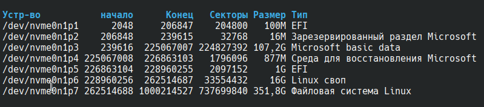
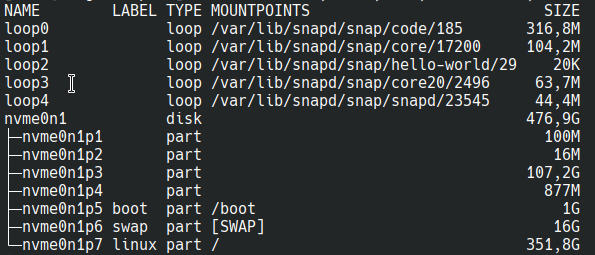

# Ультимативный гайд настройки arch linux

# 1. Загрузка
Крайнюю версию дистрибутива можно скачать с офицального [__сайта__](https://archlinux.org/download/)  
или офицального русского [__зеркала__](https://mirror.yandex.ru/archlinux/iso/latest/).


# 2. Перед установкой

## 2.1 Установка раскладки клавиатуры
Выбрать русскую раскладку 
```console
loadkeys ru
```

Выбрать консольный шрифт, поддерживающий кириллицу
```console
setfont cyr-sun16
```

## 2.2 Соединение с интернетом по Wi-fi
Проверяем название сетевого интерфейса (обычно это __wlan0__).
```console
ip link
```
Иногда сетевой интерфейс может быть отключён физически или программно.
На всякий случай разблокируем возможность переключения питания беспроводной карты
```console
rfkill unblock wifi
```

Проверим заблокированные устройства
```console
rfkill list
```

Включаем сетевой интерфейс
```console
ip link set wlan0 up
```

Проверям, что сетевая карта подключена. У меня вывел интерфейс __lo__, но подключение через __wlan0__ также работает
```console
iwctl device list
```

Выводим список доступных Wi-Fi сетей
```console
iwctl station wlan0 get-networks
```

Подключаемся к нужной сети __\<MY_WI_FI\>__. Далее попросит ввести пароль.
```console
iwctl station wlan0 connect <MY_WI_FI>
```

Проверям подключение к интернету
```console
ping ya.ru
```

## 2.3 Синхронизация системных часов
```console
timedatectl set-ntp true
```

## 2.4 Разбиение дисков на разделы
Посмотреть какие диски вам доступны можно так
```console
fdisk -l
```

Но по моему мнению самый удобный способ посмотреть диски так. Но данная комманда не выводит перед названиями дисков путь __/dev/__.
```console
lsblk -o NAME,LABEL,TYPE,MOUNTPOINTS,SIZE
```


Размечаем диск (в моейм случае это __nvme0n1__). Необходимо сделать один раздел загрузки __efi__, один под __swap__ и один под корневой раздел.
```console
cfdisk /dev/nvme0n1
```

Теперь каждый диск нужно разметить в свою файловую систему
```console
mkfs.fat -F32 /dev/nvme0n1p5 -n boot
mkswap /dev/nvme0n1p6 -L swap
mkfs.ext4 /dev/nvme0n1p7 -L linux
```

Теперь нужно смонтировать все диски. Можно указывать полное название диска или указывать метки.  
Монтируем корневой раздел
```console
mount /dev/nvme0n1p7 /mnt
```
```console
mount -L linux /mnt
```

Монтируем раздел загрузки. Также комманда создаст папку __/mnt/boot__
```console
mount --mkdir /dev/nvme0n1p5 /mnt/boot
```
```console
mount -L boot --mkdir /mnt/boot
```

Включаем подкачку
```console
swapon /dev/nvme0n1p6
```
```console
swapon -L swap
```

# 3. Установка
## 3.1 Выбор зеркал
Для ускорения загрузки пакетов необходимо поправить конфигурационный файл
```console
nano /etc/pacman.d/mirrorlist
```

В начало файла нужно добавить зеркало яндекса
```console
Server = https://mirror.yandex.ru/archlinux/$repo/os/$arch
```

## 3.2 Установка основных пакетов
__pacstrap__ используется для установки базовой системы Arch Linux в новый корневой каталог (__/mnt__ или любой другой). Он позволяет создать новую систему с нуля, устанавливая необходимые пакеты, такие как __base__, ядро (__linux__) и прошивки (__linux-firmware__). __pacstrap__ работает с помощью __pacstrap__, который является менеджером пакетов Arch Linux, но он предназначен для установки пакетов в новый корневой каталог, а не в текущую систему.
```console
pacstrap /mnt base base-devel texinfo linux linux-firmware
sudo htop git nano vim
man-db man-pages
grub os-prober efibootmgr
mtools dosfstools fuse3
inetutils dhcpcd netctl dialog wpa_supplicant
openssh ark unzip unrar
amd-ucode (or intel-ucode)
```

## 3.3 Создание файла fstab
Необходимо сгенерировать файл __fstab__, чтобы при последующих входов в систему диски автоматически монтировались в нужные паки
```console
genfstab -pU /mnt >> /mnt/etc/fstab
```

## 3.4 Изменить корневой каталог root
Используем __arch-chroot__ для перехода в среду chroot, которая позволяет изменить корневой каталог для запущенного процесса и его дочерних процессов
```console
arch-chroot /mnt
```

## 3.5 Установка пароля root
```console
passwd
```

## 3.6 HOSTNAME
Прописываем имя компьютера для локальной сети
```console
nano /etc/hostname
```

## 3.7 Настройка часового пояса для Московского времени
```console
ln -sf /usr/share/zoneinfo/Europe/Moscow /etc/localtime
```

## 3.8 Настройка локализации
Изменяем конфигурационный файл локализации
```console
# nano /etc/locale.gen

Нужно раскомментирвоать следующие строки

en_US.UTF-8 UTF-8
ru_RU.UTF-8 UTF-8
```

Применяем настройки локализации
```console
locale-gen
```

Указать язык системы
```console
# nano /etc/locale.conf

LANG=ru_RU.UTF-8
```

Указываем язык и шрифт для консоли
```console
# nano /etc/vconsole.conf

KEYMAP=ru
FONT=cyr-sun16
```

## 3.9 Установка загрузчика

Устанавливаем загрузочный RAM диск для установленного ядра
```console
mkinitcpio -p linux
```

Если вы ставите Arch Linux как вторую систему рядом с Windows, то нужно подключить __efi__ раздел Windows, чтобы при установке os-prober мог увидеть загрузочный раздел Windows (в моём случае это первый раздел на диске __nvme0n1p1__)
```console
mkdir /efi
mount /dev/nvme0n1p1 /efi
```

Далее необходимо в настройках граб разрежить работу __os-prober__
```console
# nano /etc/default/grub

В конец файла нужно прописать или раскоментировать

GRUB_DISABLE_OS_PROBER=false
```

Устанавливаем загрузчик grub по пути __/boot__, в который смонтирован раздео загрузки.
```console
grub-install --target=x86_64-efi --efi-directory=/boot --bootloader-id=GRUB
```

Генерируем загрузочный конфиг grub
```console
grub-mkconfig -o /boot/grub/grub.cfg
```

## 3.10 Перезагрузка в установленную систему
Выход из окружения chroot
```console
exit
```

Размонтировать все разделы
```console
umount -R /mnt
```

Перезагрузить систему
```console
reboot
```

# 4. Постустановка
## 4.1 Установка интернет соединения
Включаем NetworManager для подключения wi-fi. __wifi-menu__ и __dshcpcd__ могут работать не стаблильно.
```console
systemctl enable --now NetworkManager
```
Проверям запущен ли менеджер сетей
```console
systemctl status NetworkManager
```
Также демон менеджера сетей можно запустить коммандой
```console
systemctl start NetworkManager
```

Включаем wi-fi
```console
nmcli radio wifi on
```

Просмотр доступных wi-fi сетей
```console
nmcli device wifi list
```

Подключение к wifi сети
```console
nmcli device wifi connect "Название_сети" password "Пароль"
```

Проверка подключения
```console
ping ya.ru
```

## 4.2 Настройка нового пользователя

Создаем нового пользователя. Вместо __\<MYUSERNAME\>__ вписать имя пользователя.
```console
useradd -m -g users -G wheel -s /bin/bash <MYUSERNAME>
```
Установить пароль для нового пользователя. Вместо MYUSERNAME вписать имя пользователя.
```console
passwd <MYUSERNAME>
```

Настроить sudo для нового пользователя.
```console
# nano /etc/sudoers

Раскомментировать нижеуказанную строку.

%wheel ALL=(ALL:ALL) ALL
```

## 4.3 Установка GUI plasma
Минимальная установка plasma
```console
pacman -S plasma-meta sddm konsole dolphin
```

Включаем в автозапуск дисплейный менеджер
```console
sudo systemctl enable sddm
```

